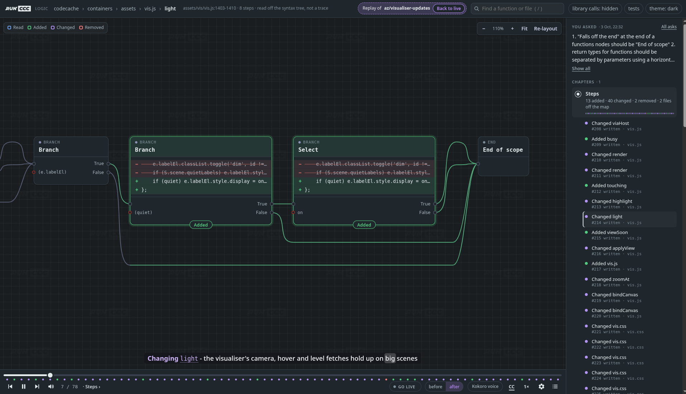

<p align="center" style="width:100%"><a href="https://github.com/colwill/ccc" target="_blank"></a></p>

[](https://github.com/colwill/ccc/actions/workflows/ccc-release.yaml)

<p align="center" style="width:100%"><a href="https://github.com/colwill/ccc" target="_blank"></a></p>

# Code Change Capture (`ccc`)

What is becoming obvious is that understanding the changes being made by LLMs/Agents to projects is an increasingly complex problem. 


## Table of content

<details>
<summary>Expand contents</summary>

- [The human contract](#the-human-contract)
- [Why does this project matter](#why-does-this-project-matter)
- [Quick-Start](#quick-start)
- [Acknowledgement](#acknowledgement)
- [Edits go through ccc](#edits-go-through-ccc)
- [Stats for heavy model usage](#stats-for-heavy-model-usage)
- [Usage](#usage)
- [Insights](#insights)
- [Architecture Visualiser](#architecture-visualiser)
- [Extension](#extension)
- [Dependency Map](#dependencymap)
- [Cross-Repository Calls](#externals)
- [Agents.md](#agentsmd)
- [Test Triggers](#testing)
- [Pipelines (CICD)](#pipelines)
- [Performance](#performance)
- [MCP Server for Agents](#mcp)
- [Token Stream](#stream)

</details>

## The human contract

The "human contract" as I've started to call it, centres around the idea that if you ask someone to review your work, code, idea that you are effectively asking them to help you and if that work was not created by you then asking a human to review it is in violation of that agreement.

This **was** widely understood and agreed on by software engineers across industry; you create a PR and ask some colleagues to review it, they didn't have to but they did because they would ask of you the same - ending the cycle. This is now being lost. Some are happy, some are not. Overall it seems to be to our detriment.

The human contract and conversation is the bulk of value in the PR review process, human thinking, edge cases, maintainability, how a product or consumer would be affected by a change etc. Slapping an agent onto your PR as-is invalidates the human contract and can cause significant frustration when engineers are reading through a change that is mostly written by an agent. It's hard to not consider this wasted time as an engineer.

Now, PRs are generated and reviewed by agents with little-to-no oversight, however; the engineers are still responsible for the code they push in work. This creates a dynamic that tends towards laziness and frustration from both AI usage on both ends and an under-appreciation of what a technical craftsman brings to a project.

Let's keep the human contract and make it easier to honour.


## Why does this project matter?

`Code Change Capture` shows everything a change by you or an agent touches (before you commit it!) visually in your IDE, in your pipeline or anywhere else you need to see it. This includes; functions, tests, services and cross-service contracts it reaches.

`ccc` is a static analyser. It looks at your project (the working dir) and generates an in-memory cache  in under half a second. This cache is read by LLMs/agents over MCP for all discovery, decision making, understanding and edits to the project. All changes made by the LLMs/Agent are tracked and can be pushed alongside a PR for the team to review with *less effort*.

The analyser can also determine what tests are going to be triggered by changes, where there are testing gaps for unit, integration, smoke etc. It also has access to a change stream from the current session which captures what an engineer has asked, what the agent viewed, reasoned about, changed or discarded in response to that ask.

The change stream is played back to the engineers in a PR or in their own IDE's for rapid review and understanding of the why, where and how of a PR.

Two side-effects of ccc:
1. It can drop token usage between 5-25% (ymmv)
2. It adds a layer of security by constraining agents to MCP tool calls (cannot use bash, sed etc).


In summary: ccc reduces the *burden of the human contract when LLMs are involved* by providing a tool to capture and visualise changes for humans - whilst enabling LLMs/Agents to make the changes they need to with significant oversight by the human in charge.


## Quick-Start

1. **Install**

    a. Latest github release (Linux / macOS / Windows)
   
   ```sh
   curl -fsSL https://raw.githubusercontent.com/colwill/ccc/main/install.sh | bash
   ```
    b. or build from source
   ```sh
   cargo build --release && ./target/release/ccc -- install
   ```

2. **Initialise `ccc init` to generate the basic `.ccc/map.json`**

    a. (recommended) edit dependency map `.ccc/map.json` to include service locations and cross-service calls

3. **Start local MCP `ccc run`**

    a. (recommended) visit `http://127.0.0.1:6767/insights` for Insights UI

4. **Register MCP server with tooling**
  
    a. claude: `claude mcp add --transport http ccc http://127.0.0.1:6767/mcp`
    
    b. copilot: `copilot mcp add --transport http ccc http://127.0.0.1:6767/mcp`

5. **Instruct your model to use the MCP tool `ccc`**

6. **Work as usual**
        

## Acknowledgement

**ccc** stands on the shoulders of [Tree-Sitter](https://github.com/tree-sitter/tree-sitter). It uses tree-sitter to scan projects with multiple langauge types and facilitates building the **ccc** code map in memory quickly.

It is designed to give engineers a always-fresh index of a project, the latest changes, how those changes impact tests or other branches (compare working branch against any other branch). In addition it also provides language models a local MCP server for an always up-to-date map of your codebase, dependencies, call-graph and cross-service calls. 

Supports: `C99`, `C++ (20 except modules)`, `C#`, `Rust`, `Go`, `Python`, `Zig`, `Odin`, `TypeScript`, `Protobuf`
& `JavaScript` - see [`LANGUAGES.md`](docs/LANGUAGES.md) for what each one resolves.

## Edits go through ccc

Agents don't only read the map - they change the code through it. A `find` or `references` answer ends with a
handle, and the `edit_*` MCP tools take that handle. One call renames a symbol across the project, deletes a dead
function, or adds code beside a definition. The agent never opens each file or edits it line by line.

- **One call per change, not one per site.** `edit_rename` follows a name through every file the map ties to it,
  including lines the map does not index, such as a `ccc:skip` body. It lists every same-named identifier it left
  alone, with the reason, so nothing changes silently.
- **Safe by construction.** Every write stays inside the project root: no `..`, no symlinks, never `.git`. Each
  change is staged and shown as a diff first. On apply, every file is checked against what it held when staged,
  and then every file is written or none is. The map is rescanned before the call returns, and `edit_revert`
  takes the change back.
- **ccc is the only writer.** The MCP server tells agents to make every change through these tools, never through
  their own Edit/Write tools or `sed -i`. That way every change is confined, previewed and revertible, and
  [`ccc prompts`](docs/MCP.md#editing) credits it to the request that asked for it.

## Stats for heavy model usage
 
Project-wide rename, dead-code delete, new functions beside an old one are a single confined, previewed and revertible atomic call that costs a fraction of the tokens read-then-edit does with an extra layer of safety ([more info](#edits-go-through-ccc))

Napkin math. Assumptions: 300-line source files at ~12 tokens a line, and an agent that must read a file before it
edits it, as Claude Code does.

| Task | Agent's own tools | Through ccc | Saving |
|---|---|---|---|
| Rename a function used at 20 sites in 8 files | grep + 8 reads + 20 edits ≈ 33k tokens, 29 calls | `references` + `edit_rename` + `edit_apply` ≈ 2.3k tokens, 3 calls | ~14x tokens, ~10x calls |
| Delete a dead 50-line function | grep + read + edit ≈ 4.4k tokens, 3 calls | `references` + `edit_delete` ≈ 1k tokens, 2 calls | ~4x tokens |
| Add a 25-line function beside an existing one | grep + read + edit ≈ 4.2k tokens, 3 calls | `find` + `edit_insert` ≈ 0.9k tokens, 2 calls | ~4.5x tokens |
| Change a few lines inside one function | read + edit | read + `edit_text` | about even |

Every call saved is also a model turn saved, and each turn re-reads the whole conversation. On a 60k-token
session, the rename's 26 fewer turns skip roughly 1.5M cached input tokens and 26 round trips of latency.

## Usage

```sh
ccc run                               # runs in-memory map and MCP server
ccc run --vis                         # opens the architecture visualiser at `:6767/vis`
ccc init                              # Generate basic `.ccc/map.json`
ccc changes [PATH] --telemetry        # Changes vs base ref (services to test for CT)
ccc tokenize                          # Encode in-memory map of project into tokens.bin + tokens.json
ccc deps [PATH]                       # Dependency delta (for CI as JSON)
ccc prompts [PATH]                    # Which requests produced specific changes (JSON)
ccc insights [PATH] --html <File>     # The insights analysis as JSON (call graph, triggers, lints)
ccc sast [PATH]                       # Security findings, defaults to non-zero on a high finding
ccc audit [PATH]                      # Resolve lockfiles and check against the OSV advisory db
ccc install [--dir] <DIR>             # Install the ccc binary onto your PATH (Linux)
ccc scan [PATH] --dir=<DIR> --tokens  # Parse tree and report map (legacy)
```

### ccc run

`ccc run` builds the project map in memory and makes it queryable by MCP via tool calls and viewable by the local web UI @ `:6767/insights`.

## ccc run --vis (Architecture Visualiser)

`ccc run --vis` serves a 2D map of the project at `http://127.0.0.1:6767/vis` and opens it in your
browser. It follows the C4 model from the whole system down to the code, then goes one level
further: the logic of a single function, drawn as a node graph.

| level | boxes | arrows |
|---|---|---|
| Context | the system; peer repos from `externals` in `.ccc/map.json`; endpoints nothing in the map answers | `ccc:calls` / `ccc:serves` crossings, by transport |
| Containers | services from `.ccc/map.json`, or top-level directories without one | resolved and declared calls between services |
| Components | the files in one container; other containers it touches sit outside the boundary | file-to-file calls |
| Code | the functions in one file, each with an input pin and one output pin per function it calls | resolved calls; functions in other files as stand-ins |
| Logic | one function: entry, calls, branches, switch/match/try arms, loops, closures, returns and throws | execution order |

Double-click (or Enter) drills down a level, Escape goes back up, and the breadcrumb jumps to any
level. Every view has its own URL, so the browser's back button works and views can be
bookmarked. Drag to rearrange; positions are remembered per view. The search box (`/`) finds
functions and files and opens them directly. The page reloads by itself when the map changes.

Every level is built from the same language-agnostic map the MCP tools read, so all supported
languages are drawn the same way. Like the rest of ccc it reads syntax, not behaviour: an arrow
is a call the resolver found evidence for, and a branch is a node in the syntax tree, not a path
anything was seen to take. Calls that reach nothing in the project (the standard library, a
dependency) are folded into grey pills, and the toolbar can show them in full or hide them.

Along the foot of the page runs a player for what agents did through ccc - the same in a browser
as in the editor. Each ask plays as a story: the agent's plan, every step it took and how it
ended, told in subtitles and read aloud, with the bar cut into chapters and a rail beside the
canvas listing them:

- **Chapters.** One for each part of the work, named for what the agent said its steps were for -
  the intent on its edit calls, the why on its reads. The chapter on show opens on its steps in
  the rail; pick a chapter or a step to go there, or **All asks** to play another ask.
- **The lines a step wrote** sit inside the nodes they fall in, what it added green and what it
  took away struck through. A change to a file the map does not draw - a stylesheet, a README -
  shows on a card over the canvas instead.
- **A definition at a time.** An edit is split into the definitions it touches - imports first,
  then what it adds, then what it changes, then what it removes - so a replay builds the change up
  one function, type or constant at a time, in the order the agent staged it.
- **Inspects too.** What an agent reads lands as an inspect of what it read, so you can see what
  it looked at before it wrote anything: `find`, `references`, `file` and `dependencies` calls as
  ccc answers them, and its own reads - Claude Code's `Read`, a `cat`, `sed -n` or `grep` of a
  file in its shell, a subagent's too - from its transcript, as it writes them.
- **Live.** While **Live** is lit each change is shown as it lands (`L` turns it on and off);
  stepping, scrubbing or picking a chapter stops on that step. Space plays and pauses, `←` and `→`
  step, `c` turns the subtitles off and `m` the voice.
- **At your pace.** 1× keeps the time between steps as it was; 1.5× and 2× hurry it, ½× and ¼×
  stretch it, and the voice reads at the same speed. Following runs behind by however many steps
  are still waiting.
- **Big views in groups.** A view of 50 or more components or functions is laid out a group at a
  time
- **Granular changes.** On in the player's settings: while a step is on show, what it did not touch
  fades back, and a big scene draws only what is wired to it, laid out together to fit the screen.
  Click the canvas to bring the rest back.

Every ccc server on a project shares its steps through `.ccc/timeline.jsonl` (kept out of git), so
the visualiser shows an agent's work whichever server the agent talks to.

The data behind the page is plain JSON, with or without `--vis`:

```sh
curl -s localhost:6767/vis.json                                  # context, containers, components
curl -s 'localhost:6767/vis/code?file=src/scan.rs'               # one file's functions and calls
curl -s 'localhost:6767/vis/flow?file=src/scan.rs&line=76'       # one function's logic
```

## Extension

[`extensions/vscode`](extensions/vscode) is an editor client for the same analysis. It runs
`ccc serve` in the background for each workspace folder and reads it over loopback HTTP, so nothing
leaves the machine and no configuration is needed to get started.

See ['EXTENSION.md'](docs/EXTENSION.md) for more information.

## DependencyMap

The `.ccc/map.json` file is used to hint to ccc where to find dependencies, for example services that call each other or share common functionality.

```json
{
  "services": {
    "auth":    ["apps/auth/**"],
    "billing": ["apps/billing/**", "libs/money/**"],
    "gateway": ["apps/gateway/**"]
  },
  "relatives": {
    "gateway": ["auth"] // gateway calls auth over HTTP, so declare it!
  },
  "externals": {
    "billing": { "repo": "acme/billing", "lang": "go", "path": "../billing" }
  }
}
```

`relatives` are the declared relationships: service to service here, or service to a peer under `externals`.

## Externals

Calls do not stop at your project. `externals` names peer repositories - a sibling checkout, another
corner of a monorepo, or a private repo you only have a published surface for - and `ccc:serves` /
`ccc:calls` comments name the key both ends agree on:

```rust
// gateway (rust)
fn checkout(cart: &[Item]) {
    // ccc:calls grpc billing.v1.Charge
    client.charge(total)
}
```

```go
// billing (go), another repository
// ccc:serves grpc billing.v1.Charge
func Charge(account string, amount int) error { ... }
```

Matching keys become real edges of the service graph, with a file and line at each end, whatever
language each side is written in. Publish a surface for others to consume with `ccc init`.

See [EXTERNALS.md](docs/EXTERNALS.md).

## Skipping code

A `ccc:skip` comment withdraws code from the analysis, in whatever comment syntax the file's
language uses. Placement decides the scope:

- **At the very top of a file** - the whole file is skipped.
- **Directly above a function** (attribute and decorator lines may sit between, a blank line may
  not) or **inside its body** - just that function is skipped: it is not measured, not ranked, and
  calls to it are not resolved.
- **Anywhere else at file level** - the whole file is skipped.

```rust
// ccc:skip generated - do not analyse
```

Trailing prose after the marker is allowed, so a skip can say why. A marker inside backticks is
documentation quoting one, not a directive, so a comment that explains `ccc:skip` withdraws
nothing.

To see everything regardless, pass `--ignore-skip` to any command - `ccc run --ignore-skip`,
`ccc changes --ignore-skip`, ... - and every `ccc:skip` reads as an ordinary comment: the code it
marks is mapped, searched, measured and edited like the rest. In the VS Code extension the same
switch is the `ccc.server.ignoreSkip` setting. Without it, a `find` or `references` that misses
also searches the skipped code as text and lists what it finds there, marked as not indexed, so
a miss never hides code you skipped.

## AGENTS.md

#### Note: To use the file-system map (instead of in-memory map); you run `ccc scan --dir` and then add a block to your AGENTS.md file to scan the `.ccc` directory instead.

(recommended) For those using `ccc run`; add the following block to an AGENTS.md file at the root of your project - agents that read an [`AGENTS.md`](https://agents.md) at the repo root pick this up automatically e.g. Copilot, Claude, Cursor etc.

```md
# AGENTS.md

This repo has a Code Change Capture (ccc) map - a generated in-memory code map served over MCP at `http://127.0.0.1:6767/mcp`. Use it
as the entry point for everything you do here.

- no bash, grep or sed usage for exploring the project
- Every interaction: use `ccc` tool calls to gather information about the source of this project.
- All thinking, navigation, and questions about the codebase go through the MCP server tools: (index, find, references, dependencies, vulnerabilities, deps, security, file, notes, changes, prompts, pr_summary, test_triggers, test_targets, lints, hot, services, refresh)
- When I ask to *see* the analysis, call `insights` - it opens the insights UI in my browser (off under `ccc run --no-html`)
- ccc is the only writer: make every change through its edit tools - `edit_rename`, `edit_replace`, `edit_delete`, `edit_insert` or `edit_text`, then `edit_apply` - never your own Edit/Write tools, `sed -i` or shell redirection.
- `edit_apply` rescans the map before it answers; call `refresh` only after a change made outside ccc.

```

Because the agent loads `AGENTS.md` at the start of a session, this wires the code map into every interaction:
reasoning and answers come from `ccc`'s map, and every change goes back through `ccc`, so it stays inside the
project, is previewed before it is written, and can be reverted.

## Testing

See [TESTING.md](docs/TESTING.md)

## Pipelines

See [PIPELINES.md](docs/PIPELINES.md)

## Performance

See [PERF.md](docs/PERF.md)

## MCP

See [MCP.md](docs/MCP.md)

## Stream

See [STREAM.md](docs/STREAM.md)
